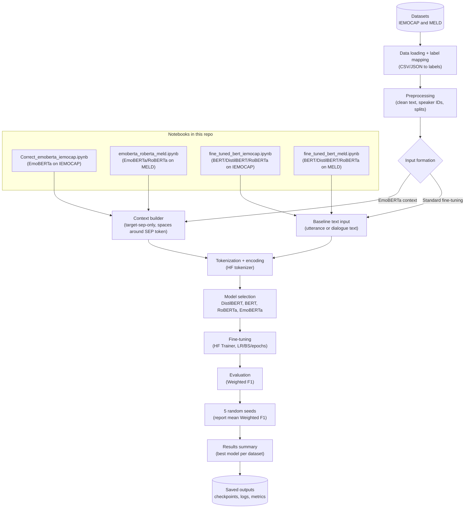

# Emotion Recognition in Conversations (ERC) with Transformers & Explainability

This repository contains code and experiments for Emotion Recognition in Conversations (ERC) using Transformer-based text encoders and a multi-level explainability pipeline. We study ERC on MELD and IEMOCAP, comparing single-utterance emotion classifiers (fine-tuned BERT/DistilBERT/RoBERTa baselines) against a context-aware variant (EmoBERTa-style) that incorporates dialogue history and speaker cues by constructing contextualized inputs. Beyond performance (e.g., weighted F1 on test splits), we provide interpretability analyses at multiple granularities, including utterance-level explanations , corpus-level token importance (e.g., GradSHAP-style global profiles), and representation/geometry diagnostics (layer-wise analyses, logit-lens trends, and CLS embedding visualizations with clustering metrics). The goal is to quantify how context and fine-tuning affect both accuracy and the evidence used by the model in conversational settings.



---

## What’s inside (high level)

**Models**
- **Single-utterance baselines:** DistilBERT-base, BERT-base, RoBERTa-base (full fine-tuning)
- **Context-aware model:** RoBERTa-base with **EmoBERTa-style input construction** (speaker-aware, context window under a token budget)

**Datasets (text transcripts)**
- **MELD**
- **IEMOCAP**

**Evaluation**
- Main metric: **Weighted F1** (suited to imbalanced class distributions)
- Diagnostics: **confusion matrices** (including per-epoch tracking where applicable)

**Explainability**
- **Utterance-level (local):** LIME, KernelSHAP / SHAP-style explanations, GradSHAP, Optimus token importance (attention-derived diagnostics)
- **Corpus-level (global):** aggregated token importance per emotion, layer-wise relevance (LIG + LGXA), Logit Lens trajectories
- **Representation geometry:** **[CLS] embedding** t-SNE visualizations + quantitative clustering metrics

---

## Repository structure
```text
datasets/
├── meld/
│   ├── train.csv
│   ├── val.csv
│   └── test.csv
└── iemocap/
    ├── train.csv
    ├── val.csv
    └── test.csv

Explainability/
├── Utterance_explanation.ipynb
├── Corpus_level_explanation.ipynb
├── Optimus_Emoberta_Utterance_Level.ipynb
└── Optimus_Corpus_analysis.ipynb

Models/
├── Emoberta_meld/
├── Emoberta_iemocap.ipynb
├── fine_tuned_meld_distilbert_bert_roberta.ipynb
└── fine_tuned_iemocap_distilbert_bert_roberta.ipynb

README.md
```

### About the dataset CSVs
- All datasets are stored under `datasets/` **in `.csv` format**.
- `datasets/meld/` contains **train/val/test** splits for MELD.
- `datasets/iemocap/` contains **train/val/test** splits for IEMOCAP.

---

## Setup

Create an environment (recommended) and install dependencies:

```bash
pip install -U pip
pip install torch transformers pandas numpy scikit-learn matplotlib shap lime captum
```

> Notes:
> - Notebooks were originally run in **Google Colab**. If paths point to Drive (e.g., `/content/drive/...`), replace them with your local paths.
> - GPU is recommended for training and for some explainability runs.
> - For our experiments we used NVIDIA A100 for Fine-tuning and NVIDIA L4 for explainability
---

## Training & evaluation

### Single-utterance fine-tuning
The single-utterance baselines fine-tune a pretrained encoder with a classification head using the **target utterance only**.

Typical hyperparameters used in this project:
- **Epochs:** 5  
- **Learning rate:**  
  - BERT / DistilBERT: **3e-5**  
  - RoBERTa: **2e-5**
- **Metric:** Weighted F1 on the test split  
- **Reporting:** mean over **5 random seeds**


### Context-aware (EmoBERTa-style)
The context-aware model builds a **speaker-aware input sequence** by expanding around the target utterance with past/future turns under a token limit, and then fine-tunes RoBERTa on this constructed input.
Typical hyperparameters used in this project:
- **Epochs:** 6  
- **Learning rate:**  
  - LR: **2e-5**
- **Metric:** Weighted F1 on the test split  
- **Reporting:** mean over **5 random seeds**

- Input: context-constructed text (In order to construct on-the-fly the context-constructed dataset run the Models/Emoberta_X.ipynb )

We report the mean weighted F1 over 5 random seeds.

  | Model                 | Dataset | Weighted F1 |
  | --------------------- | ------- | ----------: |
  | Emoberta              | MELD    |     0.63905 |
  | Emoberta              | IEMOCAP |    0.639297 |
  | Fine Tuned RoBERTa    | MELD    |    0.626903 |
  | Fine Tuned RoBERTa    | IEMOCAP |    0.547492 |
  | Fine Tuned BERT       | MELD    |    0.623891 |
  | Fine Tuned BERT       | IEMOCAP |    0.545502 |
  | Fine Tuned DistilBERT | MELD    |    0.612383 |
  | Fine Tuned DistilBERT | IEMOCAP |    0.527937 |

---

## Explainability workflow (how to reproduce)

### 1) Utterance-level analysis
Use `Explainability/Utterance_explanation.ipynb` to:
- run local explanations on selected examples (LIME / SHAP / GradSHAP),
- compare **single-utterance vs context-aware** ,
- visualize which words/tokens contribute most to a specific prediction.

Use `Explainability/Corpus_level_explanation.ipynb` to:

### 2) Corpus-level analysis
- aggregate token importance across the full test set per emotion,
- connect recurring confusions (from confusion matrices) to missing/overlapping lexical evidence.

### 3) Layer-wise diagnostics
Use the layer-wise sections (Captum's LGXA/LIG + Logit Lens) to:
- quantify **where** (which layers) the prediction signal concentrates,
- check if fine-tuning shifts “decision making” toward later layers.

### 4) CLS embedding geometry
Use the CLS embedding notebooks/sections to:
- visualize pre- vs post-fine-tuning structure with **t-SNE**,
- validate trends with cluster metrics (not only 2D plots).

### 5) Optimus (global attention-derived diagnostics)
Use:
- `Explainability/Optimus_Emoberta_Utterance_Level` (local/utterance-level)
- `Explainability/Optimus_Corpus_analysis` (global statistics)

These notebooks produce cumulative contribution curves and coverage-style diagnostics that help quantify how **concentrated vs distributed** token importance is across models.

---


